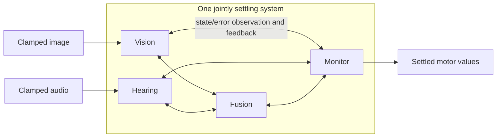

# Building a recursively observing brain

Cadence builds **processing populations and recursive observers in one jointly
settling graph**. Population size is explicit. Sensory data, ordinary
representation connections and observation of internal activity have distinct
roles. Each patch has live state, incoming ports, exact prediction-error
readback and retained local relation parameters. Feedback repairs one coupled
state. Performance evaluations and comparisons remain ongoing.

## Build the layout

```python
from cadence import Cortex

cortex = Cortex(seed=7)
eyes = cortex.input("eyes", shape=(8, 8))
ears = cortex.input("ears", shape=(2, 16))
body = cortex.input("sensory_nerves", shape=(8,))
senses = (eyes, ears, body)

c1 = cortex.column("perception", patches=256, inputs=senses)
c2 = cortex.observer(
    "integration", patches=256, inputs=senses, observes=(c1,),
)
c3 = cortex.observer(
    "reflection", patches=256, inputs=senses, observes=(c1, c2),
)
motors = cortex.output("motor_nerves", shape=(8,), reads=c3)
brain = cortex.build()

layout = brain.inspect()
assert layout["patches"] == 768
assert layout["input_samples"] == 104
assert layout["sensor_coverage"] == 104
```

The small sensor shapes keep this example inexpensive. A camera can declare
`shape=(240, 320, 3)` instead; larger inputs increase connection count and
work. Shape does not provide a trained visual interpretation, and pixel
samples are not processing patches. Eight output values expose eight selected
patch states. There is no separate policy network after settlement.

## Parallel processing and recursive observation

Use `inputs` for sensor samples or represented data. For example, vision and
hearing can form parallel branches before a fusion population:

```python
parallel = Cortex(seed=3)
image = parallel.input("image", shape=(4, 4))
audio = parallel.input("audio", shape=(4,))
vision = parallel.column("vision", patches=8, inputs=image)
hearing = parallel.column("hearing", patches=8, inputs=audio)
fusion = parallel.column("fusion", patches=8, inputs=(vision, hearing))
monitor = parallel.observer(
    "monitor", patches=4, observes=(vision, hearing, fusion),
)
parallel.output("move", shape=(2,), reads=monitor)
parallel_brain = parallel.build()

result = parallel_brain.settle({"image": [0.2] * 16, "audio": [0.1] * 4})
assert result["qualified"]
print(result["outputs"]["move"])
```

`observes` connects both **live patch states and their exact current prediction
errors**. Its constraints send feedback into the states it observes through
the same energy. A higher observer can include `monitor` in its scope.
`column` and `observer` use the same processing-patch law; their distinction
is their connections. An observer can also receive ordinary `inputs`.



The inspector's edges describe read dependencies. Returning influence is
computed from the energy derivatives at those same connections. The diagram's
two-way connections describe that influence; they do not imply a second,
independently learned reverse edge. Raw sensory samples stay fixed throughout
a solve. Feedback changes internal interpretations, not the supplied samples.

Parallel branches need no arbitrary sequencing as completed neural answers.
Each repair considers the current complete state; all participating populations
are included in final numerical qualification. The implementation uses a
synchronized reference schedule, not parallel hardware execution.

## What a processing patch computes

Patch `i` owns live state `x_i` and retained local relation parameters `w_i, b_i`.
Its incoming signals are sensor samples, other live states, or observed errors:

```text
p_i = tanh(b_i + sum_j w_ij * signal_j)
e_i = x_i - p_i

E = 1/2 sum_i e_i² + state_prior/2 sum_i x_i²
```

Prediction `p_i` and error `e_i` are recomputed exactly. They are not separately
adjustable reports that could hide a disagreement. Error-readback definitions
must be acyclic: a newly declared observer can read existing populations,
including existing observers. State coupling and its returning influence remain
part of one joint problem. This restriction is on how a derived quantity is
defined, not a feed-forward execution of the brain.

Repair uses the analytic derivatives of this energy with respect to eligible
coordinates, projected into bounded boxes. Derivatives include the effects of
observed errors on their observers. Backtracking accepts a step only when
it decreases the declared energy sufficiently. There is one repair procedure
for live-state queries and experience admission; admission also makes relation
parameters eligible and adds the fixed anchoring term below.

This reference engine uses derivatives and a global energy acceptance check.
It does not establish a gradient-free algorithm or asynchronous distributed
confluence. Nonlinear energy can have multiple stationary points; different
initial states need not produce identical answers. The full projected
stationarity test may refuse when its budget is exhausted.

**Stationarity and prediction error are different measurements.** A qualified
compromise can retain nonzero prediction errors. `stationarity` checks whether
any allowed repair direction remains larger than the tolerance;
`prediction_residual` reports the largest absolute prediction error. Neither
number is a task accuracy score.

## Learn from an actual experience

`observe` clamps supplied output witnesses and jointly repairs live state and
local relation parameters. A proximal prior anchors the parameters to their
values immediately before this experience:

```text
E_learning = E + parameter_prior/2 * ||parameters - previous_parameters||²
```

The anchor remains fixed throughout this solve. A qualified proposal commits
its state, parameters and event identity atomically. A refused proposal commits
nothing. This is native supervised witness learning. Reward-driven temporal
credit, episodic retrieval, imagination policies and learned structural growth
are further capabilities, not implied by this method.

```python
teacher_layout = Cortex(seed=2, settle_budget=1200, tolerance=1e-5)
signal = teacher_layout.input("signal", shape=(1,))
base = teacher_layout.column("base", patches=4, inputs=signal)
reflection = teacher_layout.observer(
    "reflection", patches=2, inputs=signal, observes=base,
)
teacher_layout.output("answer", shape=(1,), reads=reflection)
learner = teacher_layout.build()

for event_id in range(40):
    value = (-0.8, 0.8)[event_id % 2]
    update = learner.observe(
        {"signal": [value]}, {"answer": [value]}, event_id=event_id,
    )
    assert update["accepted"]

# No target clamps here: these amplitudes were absent from teaching.
assert learner.predict({"signal": [-0.4]})["answer"][0] < -0.2
assert learner.predict({"signal": [0.4]})["answer"][0] > 0.2
```

Training outputs equal their clamps by construction, so reporting them as
learning accuracy would be invalid. Tests instead check subsequent **unclamped
predictions**, new inputs and controls without admission or sensory access.
This tiny example demonstrates acquisition of an input-dependent relation;
it is not evidence that the observer improves it over a simpler model.

## Configure and inspect

The [API reference](REFERENCE.md) documents every constructor parameter, method,
result field and shape rule. `brain.inspect()` reports exact patch, input and
connection counts, sensor coverage and observation roles. `brain.config` is
read-only. Width, depth and sparse wiring all change resource cost; see
[layout variants](VARIANTS.md).

`brain.settle(inputs)` is a pure query; `brain.step(inputs)` retains qualified
live state with parameters frozen. `brain.observe(inputs, targets)` also permits
relation changes from witnessed outputs. Check `qualified` or `accepted` before
using a result. `brain.predict(inputs)` raises `SettlementError` on refusal.
Serialize calls to each brain; there is no concurrent mutation contract.

## Continuation and tests

```python
from cadence import Brain

saved = learner.snapshot()
restored = Brain.from_snapshot(saved)
assert restored.snapshot() == saved
assert restored.predict({"signal": [0.4]}) == learner.predict({"signal": [0.4]})
```

Checkpoints bind the complete configuration, graph identity and the exact
layout, repair and validation source hashes. Loading requires these sources to
match exactly, including across releases. A checkpoint is a continuation record,
not proof that its witnesses came from a real environment. Queries and
hypothetical interventions do not add witnesses. Restore validates the entire
proposal before replacing a live brain.

Run the focused tests and executable documentation with:

```sh
python -m pytest -q tests/test_drsn.py tests/test_drsn_math.py tests/test_documentation.py
```

The suite covers parallel and nested layouts, multimodal shapes, exact patch
counts, sparse source coverage, live-error derivatives, reciprocal intervention,
energy descent, bounded stationary solutions, refusal, actual acquisition,
event custody, configuration and checkpoint validation. Finite differences
check derivatives through recursive error readback and recurrent state contacts.
Larger application results and advantages over competing architectures require
separate controlled tests.
