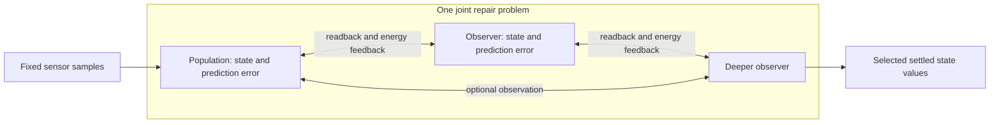

# The processing patch

Every processing patch owns a live scalar state `x_i` and retained relation
parameters: one weight per incoming signal and one bias. A population groups
patches; an observer is a population connected to other populations' current
states and prediction errors. These are software abstractions inspired by
cortical organization, not simulations of biological cortical columns.

Use coupled populations for application routines; a population that settles
with no other population does not build. Coupling already allows returning
influence through the joint energy. Observer wiring
is [experimental opt-in](EXPERIMENTAL.md): its exact error contacts participate
in every solve, with no automatic sleeping or demonstrated task advantage.

## Prediction and disagreement

```text
signal_j = clamped sensory sample, live patch state, or live prediction error
p_i      = tanh(b_i + sum_j w_ij * signal_j)
e_i      = x_i - p_i
E        = 1/2 sum_i e_i² + state_prior/2 sum_i x_i²
```

`tanh` is the local prediction function. Agreement means reducing disagreement
between each patch's state and its incoming relation. It does not mean forcing
all patches to the same number. The activity prior is part of this objective.
Sensory values remain fixed; patch states are repaired together.

Errors are recomputed from state and relations, including errors used as
observer inputs. They are never independently writable reports. An observer's
energy term affects its observed states through the exact derivatives,
including transitive error dependencies. There is no separate reverse weight
for that returning influence.

This diagram illustrates the experimental recursive wiring, not a required
application layout:



The builder permits new populations to read previously declared ones. This
makes derived error definitions acyclic. It does not turn settlement into a
sequence of completed layer answers: the full gradient and qualification
include every participating population simultaneously. The private mathematical
kernel also admits recurrent state contacts; the public builder exposes a
structured declaration graph rather than arbitrary edge editing.

## One repair procedure, different eligible coordinates

The **bootstrapping phase** and **live phase** use this same patch law. They
describe when an application prepares and runs its brain, not separate
mathematical modes. Actual witnesses can support learning in either phase.

A query freezes parameters and computes repair derivatives for live state;
unused parameter derivatives are not evaluated. `step` can retain that live
state. `observe` fixes supplied output coordinates and also repairs weights
and biases, adding a prior anchored to the pre-experience parameters:

```text
E_learning = E + parameter_prior/2 * ||parameters - anchor||²
```

`observe_batch` uses the same relations for several labeled experiences.
Each row has private patch activity, initialized from the same retained live
state, while weights and biases are shared:

```text
E_batch = mean_b(E_b) + parameter_prior/2 * ||parameters - anchor||²
```

The one anchor is fixed at the pre-batch parameters. All private states and
shared parameters repair jointly. A successful batch retains parameters and
one event identity while preserving live state; the private states are returned
as diagnostics. Serial `observe` calls instead retain each solved state and
reanchor after each admission, so batching changes the learning trajectory.

The anchor stays fixed for the whole admission. Retained parameters are the
memory used by later queries; warm live state is distinct from this durable
learning. These parameters remain plastic; the prior is not protected
consolidation. `source="witness"` labels measured targets and
`source="estimate"` labels derived targets without changing this equation.
The `Reinforcement` helper computes one-step Q estimates from actual transition
records and fits them through batch repair. It supplies an explicit reward
algorithm rather than deriving task objectives from mere exposure. Parameters
are frozen only for individual query or `step` calls.

`History` is caller-fed sensory context, and `LearningProgress` is error-reduction
bookkeeping. Neither adds a patch rule or claims learned recurrent memory.
Live scheduling and actuator smoothing also remain outside the energy;
see [the live-system guide](LIVE.md).

Each sweep computes analytic derivatives, projects a candidate into configured
state/parameter bounds, then backtracks until a sufficient energy decrease is
found. Accepted displacement and gradient change estimate the next scalar step;
unsafe estimates use the configured initial step. A final proposal meeting the
full stationarity threshold may finish within eight energy ulps when rounding
prevents sufficient decrease; ordinary steps retain that decrease requirement.
All eligible coordinates share
this procedure. The implementation is a
synchronized reference solver with a global energy check, not an asynchronous
local-message protocol. Optional tensor execution uses the same equations and
analytic derivatives, parallelizing eligible arithmetic on CPU/GPU. Device
proposals are checked against the original float64 objective and exact clamps;
reference refinement may use the remaining sweep budget. Device rounding can
change the intermediate path, but never relaxes the final qualification
threshold. See [execution and precision](ACCELERATION.md).

## What qualification means

For free coordinates `z`, let `P` project into their allowed box. The reported
stationarity measure is:

```text
max_abs(z - P(z - grad(E))) <= tolerance
```

The projection uses a unit step for this diagnostic, independent of the
line-search `step`. Clamped coordinates are excluded. Learning includes the
parameter coordinates; a query does not. For batches, apply the state diagnostic
to each row's energy before averaging, and the shared parameter diagnostic to
the complete mean-plus-anchor objective. This keeps the tolerance independent
of batch size. Stationarity allows outward gradients
at a boundary and does not require zero prediction error. The nonlinear
objective can have multiple stationary points. No uniqueness, global optimum,
biological equivalence or advantage from extra observers follows from this
qualification. See [the specification](SPECIFICATION.md) for the runtime
contract and [the reference](REFERENCE.md) for controls.
