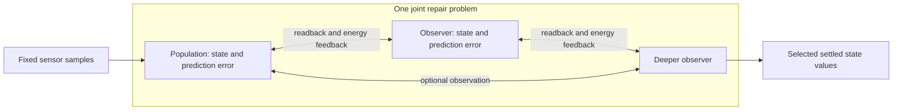

# The processing patch

Every processing patch owns a live scalar state `x_i` and retained relation
parameters: one weight per incoming signal and one bias. A population groups
patches; an observer is a population connected to other populations' current
states and prediction errors. These are software abstractions inspired by
cortical organization, not simulations of biological cortical columns.

## Prediction and disagreement

```text
signal_j = clamped sensory sample, live patch state, or live prediction error
p_i      = tanh(b_i + sum_j w_ij * signal_j)
e_i      = x_i - p_i
E        = 1/2 sum_i e_i² + state_prior/2 sum_i x_i²
```

`tanh` is the local prediction function. Agreement means reducing disagreement
between each patch's state and its incoming relation. It does not mean forcing
all patches to the same number. The activity prior is part of this objective.
Sensory values remain fixed; patch states are repaired together.

Errors are recomputed from state and relations, including errors used as
observer inputs. They are never independently writable reports. An observer's
energy term affects its observed states through the exact derivatives,
including transitive error dependencies. There is no separate reverse weight
for that returning influence.



The builder permits new populations to read previously declared ones. This
makes derived error definitions acyclic. It does not turn settlement into a
sequence of completed layer answers: the full gradient and qualification
include every participating population simultaneously. The private mathematical
kernel also admits recurrent state contacts; the public builder exposes a
structured declaration graph rather than arbitrary edge editing.

## One repair procedure, different eligible coordinates

A query freezes parameters and repairs live state. `step` can retain that live
state. `observe` fixes witnessed output coordinates and also repairs weights
and biases, adding a prior anchored to the pre-experience parameters:

```text
E_learning = E + parameter_prior/2 * ||parameters - anchor||²
```

The anchor stays fixed for the whole experience. Retained parameters are the
memory used by later queries; warm live state is distinct from this durable
learning. This engine does not claim that mere exposure to any stream discovers
a useful task or supplies a reward-learning algorithm.

Each sweep computes analytic derivatives, projects a candidate into configured
state/parameter bounds, then backtracks until a sufficient energy decrease is
found. Accepted displacement and gradient change estimate the next scalar step;
unsafe estimates use the configured initial step. All eligible coordinates share
this procedure. The implementation is a
synchronized reference solver with a global energy check, not an asynchronous
local-message protocol.

## What qualification means

For free coordinates `z`, let `P` project into their allowed box. The reported
stationarity measure is:

```text
max_abs(z - P(z - grad(E))) <= tolerance
```

The projection uses a unit step for this diagnostic, independent of the
line-search `step`. Clamped coordinates are excluded. Learning includes the
parameter coordinates; a query does not. Stationarity allows outward gradients
at a boundary and does not require zero prediction error. The nonlinear
objective can have multiple stationary points. No uniqueness, global optimum,
biological equivalence or advantage from extra observers follows from this
qualification. See [the specification](SPECIFICATION.md) for the runtime
contract and [the reference](REFERENCE.md) for controls.
